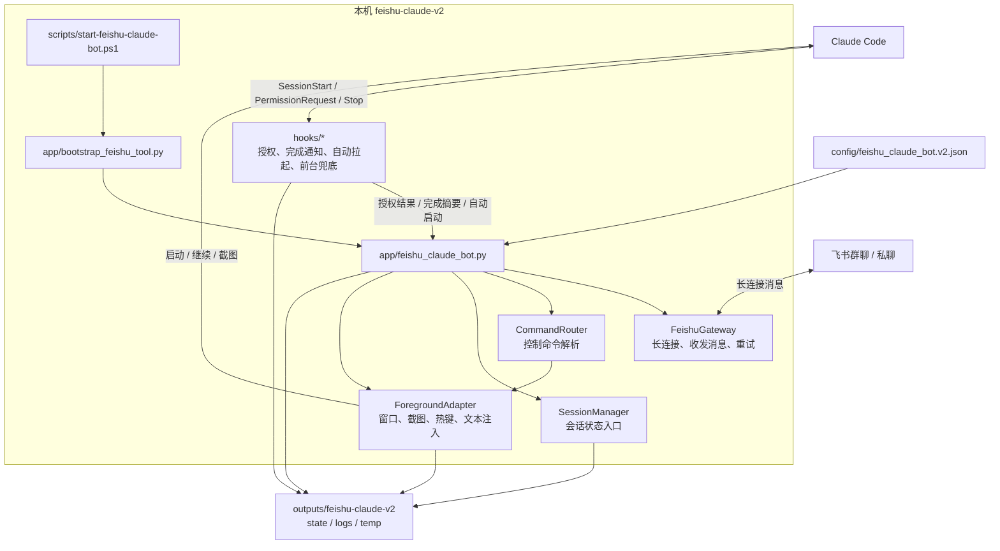

# 飞书 Claude v2 集成目录索引

本目录维护“通过飞书助手机器人控制本机 Claude Code”的本机集成。当前目录是实际运行版本，历史 v1 目录 `D:\code\codex\integrations\feishu-claude` 已冻结，仅用于追溯；新会话应从本目录启动、修改和排障。

本目录已经按职责整理，根目录只保留 `INDEX.md` 作为唯一入口；实际代码、配置、脚本、测试和细化文档都放在子目录中。

## 1. 当前状态

- 主配置为 `config/feishu_claude_bot.v2.json`。
- 默认配置模板是 `config/feishu_claude_bot.v2.example.json`。
- Claude hook 和飞书长连接机器人均应指向本目录。
- 默认运行输出写入 `D:\code\codex\outputs\feishu-claude-v2`，避免与历史版本的 state、log 和临时脚本混用。

## 2. 目录结构

- `app/`
  - 飞书长连接机器人主程序和 Python 启动包装器。
  - 主要维护文件：`feishu_claude_bot.py`、`bootstrap_feishu_tool.py`。

- `hooks/`
  - Claude Code hook 桥接脚本。
  - 负责 `SessionStart` 自动拉起、`PermissionRequest` 飞书授权、`Stop` / `StopFailure` 完成通知、前台窗口兜底观察。

- `scripts/`
  - 人工启动、停止和 hook 命令入口脚本。
  - 当前主启动脚本：`start-feishu-claude-bot.ps1`。

- `config/`
  - 本机配置和脱敏示例配置。
  - 当前生效配置：`feishu_claude_bot.v2.json`。
  - 示例配置：`feishu_claude_bot.v2.example.json`。

- `tests/`
  - 本机模拟回归脚本。
  - 用于验证飞书命令路由、单窗口复用、hook 通知和状态更新。

- `docs/`
  - 面向人阅读的操作说明、排障说明和维护说明。
  - 当前主说明文档：`README.md`。
  - 维护说明文档：`MAINTENANCE.md`。

- `archive/`
  - 历史方案归档。
  - 只用于追溯和排障，不作为当前生效入口。

- `vendor/`
  - 飞书 Python SDK 的本地兜底依赖。
  - 仅作为本机离线兜底，正常源码提交不包含该目录；恢复环境时使用 `requirements.txt` 安装依赖。

## 3. 根目录规范

根目录只保留 `INDEX.md`。新增代码、配置、脚本、测试、文档或历史归档时，应放入对应子目录，避免再次回到根目录平铺。

## 4. 当前生效链路

- 飞书长连接主进程：`app/feishu_claude_bot.py`
- 启动包装器：`app/bootstrap_feishu_tool.py`
- 配置文件：`config/feishu_claude_bot.v2.json`
- 授权 hook：`hooks/feishu_claude_permission_hook.py`
- 完成 hook：`hooks/feishu_claude_turn_hook.py`
- 前台返回兜底：`hooks/feishu_claude_foreground_return.py`
- 前台长期观察：`hooks/feishu_claude_foreground_watch.py`
- 自动拉起 hook：`hooks/feishu_claude_bot_autostart.py`
- 自动拉起通知：`hooks/feishu_claude_autostart_notice.py`

## 5. 架构图



## 6. 启动前检查

1. 基于 `config/feishu_claude_bot.v2.example.json` 准备 `config/feishu_claude_bot.v2.json`。
2. 确认所有输出路径指向 `D:\code\codex\outputs\feishu-claude-v2`。
3. 安装 Python 依赖：`python -m pip install -r "D:\code\codex\integrations\feishu-claude-v2\requirements.txt"`。
4. 确认 Claude hook 设置也指向本目录的 `hooks/` 和 v2 配置文件。
5. 如果发现 hook 或启动脚本仍指向 `integrations\feishu-claude`，应视为旧配置残留并迁移到 v2。

## 7. 启动命令

推荐从整理后的脚本启动：

```powershell
powershell -ExecutionPolicy Bypass -File "D:\code\codex\integrations\feishu-claude-v2\scripts\start-feishu-claude-bot.ps1"
```

仅做启动校验：

```powershell
powershell -ExecutionPolicy Bypass -File "D:\code\codex\integrations\feishu-claude-v2\scripts\start-feishu-claude-bot.ps1" -ValidateOnly
```

## 8. 验证命令

语法检查：

```powershell
python -m py_compile app\feishu_claude_bot.py hooks\feishu_claude_permission_hook.py hooks\feishu_claude_turn_hook.py hooks\feishu_claude_foreground_watch.py hooks\feishu_claude_foreground_return.py hooks\feishu_claude_bot_autostart.py hooks\feishu_claude_autostart_notice.py
```

验证飞书消息路由和单窗口行为：

```powershell
python "D:\code\codex\integrations\feishu-claude-v2\tests\simulate_feishu_bot_regression.py"
```

验证 Claude hook 授权、完成通知和前台兜底：

```powershell
python "D:\code\codex\integrations\feishu-claude-v2\tests\simulate_feishu_hook_regression.py"
```

## 9. 运行输出

运行状态和日志统一保存在 `D:\code\codex\outputs\feishu-claude-v2`：

- `state/`
  - 会话状态、授权审批状态等需要跨重启保留的数据。

- `logs/`
  - bot 主程序、hook、自动启动和排障日志。

- `temp/launchers/`
  - 前台窗口启动、前台命令发送等一次性 PowerShell 脚本。

- `temp/screenshots/`
  - Claude 窗口截图、桌面截图和截图辅助脚本。

输出目录的详细清理规则见 `D:\code\codex\outputs\feishu-claude-v2\INDEX.md`。

## 10. 四层架构进度

- `FeishuGateway`：已接管飞书长连接收消息、文本/图片发送、消息分片、发送重试和 WebSocket 断线重连；业务白名单、去重和命令分发仍由 bot 回调处理。
- `CommandRouter`：已接管截图、权限、模型等高优先级控制命令解析；运行、继续、停止、目录、多会话等命令仍在旧 `handle_command()` 中，后续需要继续迁移为结构化 intent。
- `SessionManager`：已成为 v2 bot 运行期的状态入口，旧 `self.state` 兼容别名现在指向 `SessionManager`，真实 `BotState` 只保留在 `self.state_store` 后面；Hook 脚本和旧 JSON 兼容逻辑仍直接使用 state 文件。
- `ForegroundAdapter`：已接管截图窗口解析、前台 PID/HWND 恢复、前台文本发送入口和热键入口；底层 Win32/PowerShell 脚本生成仍在旧 bot 内，当前通过 callback 方式隔离，后续可整体搬入 adapter。

## 11. 重构目标

- 收敛状态写入，后续把 JSON state 替换为 SQLite 或单写入者状态服务。
- 抽离命令路由，避免控制命令漏到 Claude 自然语言兜底。
- 抽离前台窗口适配层，统一 PID、HWND、截图、热键和文本注入逻辑。
- 测试默认使用临时 state，禁止污染真实 `outputs/feishu-claude-v2`。

下一步优先拆 `handle_command()` 和飞书事件监听，直到 `feishu_claude_bot.py` 只保留编排职责。

## 12. 飞书命令列表

| 命令 | 说明 |
|------|------|
| 帮助 | 显示所有可用命令 |
| 状态 | 查看当前任务状态 |
| 继续 | 继续上一轮 Claude 会话 |
| 前台继续 | 打开前台窗口继续执行 |
| 暂停 | 发送 Ctrl+C 中断当前操作，保留窗口 |
| 停止 | 发送"停止"给 Claude，关闭窗口 |
| /stop | 强制终止 Claude 进程 |
| 目录 <路径> | 切换工作目录 |
| 权限 <模式> | 切换授权模式 |
| 模型 <模型> | 切换模型 |
| 截图 claude | 截取 Claude 窗口 |
| 窗口列表 | 查看可接管的前台窗口 |
| 切换窗口 <N> | 切换到指定窗口 |

## 13. 变更记录

### 2026-05-28

- 新增"暂停"命令：发送 Ctrl+C 中断当前操作，保留窗口不关闭
- 修复剪贴板编码问题：命令文本改为临时文件传递，避免 CLI 参数编码破坏
- 修复 STA 线程问题：PowerShell 脚本添加 `-STA` 标志
- 修复剪贴板竞争：`Clipboard.SetText` / `Set-Clipboard` 添加 5 次重试
- feishu_bot_common、feishu-codex 和所有辅助文件添加行级注释

## 14. 排障入口

- 机器人收不到飞书消息：
  - 先看 `outputs\feishu-claude-v2\logs\feishu-claude-bot.log` 是否出现 `recv`。

- 飞书能收到命令但 Claude 没执行：
  - 先看 `outputs\feishu-claude-v2\state\feishu-claude-bot-state.json` 的 `status`、`foreground_pid`、`last_command`。

- 授权通知没有到飞书：
  - 先看 `outputs\feishu-claude-v2\logs\feishu-claude-permission-hook.log`。

- 任务完成后没有摘要：
  - 先看 `outputs\feishu-claude-v2\logs\feishu-claude-turn-hook.log`。
  - 再看 `%USERPROFILE%\.claude\projects\<项目目录编码>\*.jsonl` 是否已经写入最新 assistant 摘要。
  - 当前 `状态` 会优先读取 Claude JSONL；PowerShell transcript 只作为兜底。

- 自动启动异常：
  - 先看 `outputs\feishu-claude-v2\logs\feishu-claude-autostart.log`。

更多操作和维护说明见 `docs\README.md` 和 `docs\MAINTENANCE.md`。
